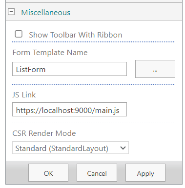

# JSLINK Demo

You can override the rendering of a classic SharePoint form using client-side JSLink rendering.

This is quite easy and does not require a local SharePoint Server as a development machine.

## How does it look

## How to install on SharePoint

Go to your EditForm and/or NewForm (https://sharepoint.com/sites/mysite/Lists/mylist/EditForm.aspx) and edit the page.

Now edit the webpart

Scroll down to "Miscellaneous" and add the link to the Jslink file

In Dev mode enter: https://localhost:9000/main.js

In Production enter ~SiteAssets/myForm/main.js

## Serving during development

run "npm run serve" in the console to start a local development server. If you added "https://localhost:9000/main.js" as a JSLink then SharePoint will fetch the file from your local environment

## Installing in production

run "npm run build" in the console. 

Now copy the dist/main.js file somewhere to your SharePoint site (i.e SiteAssets/myForm/main.js). 

Make sure that the JSLink on the webpart points to that file.